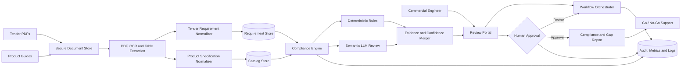

# Sarlacc Tender Compliance Assistant — Solution Design

**Date:** 2026-07-04  
**Status:** Approved design for PoC planning  
**Primary stakeholder:** Commercial engineer responsible for tender analysis

## 1. Executive Summary

Sarlacc should build a human-in-the-loop tender compliance assistant that converts tender requirements and product documentation into a cited, requirement-by-requirement compliance and gap report. The solution supports the commercial engineer's go/no-go decision; it does not automate that decision.

The recommended architecture is hybrid. Deterministic software extracts tables, normalizes units, and compares measurable values. A provider-neutral LLM reviews only narrative or ambiguous requirements. Every result retains tender evidence, product evidence, the applied decision method, and confidence. Missing or conflicting evidence always becomes `REVIEW_REQUIRED`.

The PoC go/no-go gate is at least 95% recall of mandatory tender requirements against a manually labelled golden dataset. Classification precision, review-time reduction, cost, and reviewer agreement are secondary measures.

## 2. Business Context

Sarlacc's tender process depends heavily on one commercial engineer. Tender specifications may exceed 700 pages, 5–7 tenders may arrive in a week, and one analysis can consume five working days. Approximately 80% of the specialist's time is spent reading and checking documents rather than developing quotation strategy or serving customers.

The immediate bottleneck is the technical requirement check that informs the go/no-go decision. In the supplied EPEC example, requirements include numeric limits, product features, documentation obligations, delivery conditions, warranty, inspection, certification, and spare parts. Product evidence is distributed across technical guides, manuals, and model tables.

## 3. Objective and Scope

### Objective

Reduce tender-analysis effort while preserving professional accountability by producing an auditable, evidence-backed compliance and gap report for human review.

### In scope

- PDF ingestion for tenders and Sarlacc product documentation.
- Native text and table extraction, with OCR fallback for scanned pages.
- Structured tender-requirement extraction.
- Structured catalog-specification extraction.
- Unit and terminology normalization.
- Deterministic comparison of measurable and categorical requirements.
- LLM-assisted review of narrative or ambiguous requirements.
- Three-state classification: `COMPLIANT`, `NON_COMPLIANT`, or `REVIEW_REQUIRED`.
- Page-level citations, confidence, and decision rationale.
- Human review, correction, approval, and audit trail.
- Compliance/gap report and go/no-go decision support.
- Cloud-agnostic deployment interfaces suitable for hosted or private models.

### Out of scope

- Autonomous tender submission or autonomous go/no-go decisions.
- Price optimization and commercial-strategy generation.
- ERP, CRM, or procurement-platform integration.
- Production-scale identity, billing, and multi-tenant administration.
- Training or fine-tuning a foundation model during the PoC.
- Supporting every Sarlacc product family in the first two weeks.

### PoC boundary

The first validation uses the EPEC SIC20084 tender, the battery-charger guide, and a manually labelled set of 50–100 requirements. Transformer documents may test document generalization but are not required for the initial go/no-go measurement.

## 4. Alternatives Considered

### Option 1: Rules-first

Use PDF/table extraction, schemas, unit conversion, and deterministic comparison without an LLM.

**Advantages:** Lowest variable cost, predictable behavior, strong auditability, and no model hallucination.  
**Limitations:** Weak handling of narrative equivalence, dispersed evidence, conditional clauses, and terminology variation.

### Option 2: LLM-first

Send extracted document content to an LLM for requirement extraction and compliance classification.

**Advantages:** Fast initial prototype and strong flexibility with narrative text.  
**Limitations:** Higher cost, weaker repeatability, harder validation, greater privacy exposure, and unacceptable risk if unsupported judgments are treated as facts.

### Option 3: Hybrid — selected

Use deterministic extraction and comparison for structured evidence, and constrain the LLM to ambiguous narrative review.

**Advantages:** Balances recall, precision, explainability, cost, and portability. Deterministic contradictions cannot be overridden by the LLM.  
**Limitations:** More components and a greater need for schema design, routing logic, and conflict handling.

## 5. Architecture



### Component responsibilities

1. **Review portal:** Uploads documents, displays progress, shows side-by-side citations, accepts corrections, and records approval.
2. **Workflow orchestrator:** Runs an explicit, resumable state machine for ingestion, extraction, normalization, matching, review, and export.
3. **Secure document store:** Retains original files and immutable document identifiers under access and retention controls.
4. **Extraction service:** Produces text blocks, table cells, page numbers, bounding boxes, extraction method, and confidence. OCR runs only when native extraction is insufficient.
5. **Tender normalizer:** Converts clauses into typed requirement records without discarding the original wording.
6. **Catalog normalizer:** Converts product claims and model-table values into the same vocabulary and canonical units.
7. **Compliance engine:** Routes comparable fields to deterministic rules and unresolved narrative cases to semantic review.
8. **Evidence merger:** Enforces decision precedence, detects conflicts, calculates confidence, and prevents uncited output.
9. **Audit and metrics store:** Records input hashes, extraction versions, rule versions, model and prompt versions, reviewer actions, timing, tokens, and cost.

## 6. Canonical Data Contracts

### Requirement record

```text
requirement_id
document_id
category
description
operator
required_value
unit
mandatory
conditions
source_page
source_text
source_coordinates
extraction_confidence
```

### Product-specification record

```text
specification_id
document_id
product_family
model
category
description
operator
offered_value
unit
conditions
source_page
source_text
source_coordinates
extraction_confidence
```

### Compliance result

```text
requirement_id
specification_ids
status
decision_method
rationale
tender_evidence
product_evidence
confidence
review_reason
reviewer_decision
```

Canonical values coexist with the original value and unit. This permits comparison without losing evidentiary fidelity.

## 7. Decision Logic

Decision precedence is fixed:

1. Missing or uncitable source evidence produces `REVIEW_REQUIRED`.
2. A deterministic contradiction produces `NON_COMPLIANT` and cannot be overridden by the LLM.
3. A deterministic match produces `COMPLIANT` when all applicable conditions are satisfied.
4. Narrative or ambiguous cases may receive an LLM assessment constrained to supplied evidence.
5. Low confidence, extraction conflict, or disagreement between methods produces `REVIEW_REQUIRED`.
6. The commercial engineer makes the final disposition and go/no-go decision.

Numeric rules support equality, minimum, maximum, inclusive range, tolerance, and set membership. Categorical rules use controlled vocabularies and approved synonyms. Conditional clauses retain their conditions rather than being flattened into unconditional claims.

### Example findings from supplied documents

| Requirement | Tender evidence | Sarlacc evidence | Preliminary result |
|---|---|---|---|
| Input voltage | 380 VAC, ±10% | 3×380 VAC, ±10% | `COMPLIANT` |
| Output voltage | 110 VDC | Supported, model dependent | `REVIEW_REQUIRED` until a model is selected |
| Maximum ripple | 3% | 2% | `COMPLIANT` |
| Ambient temperature | −10°C to +45°C | 0°C to +40°C | `NON_COMPLIANT` |
| Frequency tolerance | ±2% | ±5% | `COMPLIANT` |
| RS485 interface | Required if applicable | Modbus RTU over RS485 | `COMPLIANT` subject to offered configuration |
| Single float setting | Required, with conditional alternative | Float and boost modes available | `REVIEW_REQUIRED` for configuration evidence |

These examples are architecture-validation cases, not a completed commercial evaluation.

## 8. Technology Direction

| Block | PoC recommendation | Alternative not selected | Decision basis |
|---|---|---|---|
| PDF extraction | PyMuPDF or pdfplumber, OCR fallback | LLM-only parsing | Speed, cost, coordinates, repeatability |
| Table extraction | Camelot/Tabula with structural validation | Plain-text-only parsing | Technical values depend on row/column structure |
| Schemas and units | Pydantic and Pint | Unvalidated JSON | Typed contracts and consistent conversion |
| Matching | Python rule engine with configurable thresholds | LLM-only matching | Testability and auditability |
| Narrative review | Provider-neutral LLM adapter | Hard-coded provider | Hybrid/private deployment path |
| System of record | PostgreSQL and object storage | Vector database alone | Relational integrity and audit history |
| Semantic retrieval | Optional pgvector | Resend whole documents | Lower token usage and stronger traceability |
| Orchestration | Explicit service/workflow state machine | Autonomous agent | Predictable recovery and bounded behavior |
| User experience | Lightweight review portal | Automatic decision | Human accountability |

Provider names are intentionally excluded from the core design. Hosted and private adapters must implement the same semantic-review interface.

## 9. Security and Governance

- Encrypt documents and structured data in transit and at rest.
- Apply role-based access to upload, review, approve, and administer.
- Keep secrets outside source code and rotate model/API credentials.
- Define document retention and deletion policies before using live confidential tenders.
- Do not permit external model providers to train on submitted data.
- Record model, prompt, rule, and extraction versions for every result.
- Treat document text as untrusted input and isolate it from system instructions.
- Redact personal contact data from evaluation exports unless required.
- Preserve an immutable audit trail of reviewer corrections and approvals.

## 10. Failure Handling

- **Unreadable file:** Stop that document, identify affected pages, and request a better copy or human transcription.
- **Low OCR or table confidence:** Retain output but route all affected requirements to human review.
- **Unit conversion failure:** Preserve the source value and mark the comparison unresolved.
- **Conflicting clauses or specifications:** Show both citations and prohibit automatic compliance.
- **LLM timeout or provider outage:** Retry within a bound, checkpoint work, and continue deterministic processing; unresolved cases remain review-required.
- **Schema-invalid LLM response:** Reject, retry once with the validation error, then route to review.
- **Partial workflow failure:** Resume from the last completed idempotent stage rather than reprocessing the full tender.
- **Report generation failure:** Preserve approved decisions and allow export retry without rerunning analysis.

## 11. Metrics and Assumptions

### Go/no-go metric

**Go** if mandatory-requirement recall is at least 95% against the approved golden set.  
**No-go** if recall is below 95%; the system must not progress to pilot until the cause is corrected and the blind evaluation is repeated.

### Secondary PoC targets

- At least 90% compliance-classification precision.
- At least 80% reduction in active engineer review time.
- Citation coverage of 100% for surfaced requirements and compliance results.
- Reviewer agreement reported separately for numeric and narrative cases.

### Planning estimates

Assuming one 700-page tender, three product guides, mixed native/scanned pages, and selective LLM routing:

- Extraction and normalization: 45–90 minutes per large tender.
- LLM input: approximately 80,000–180,000 tokens.
- Hosted-model variable cost: approximately USD 2–15 per large tender.
- Private-model API cost: near zero, excluding infrastructure and operations.
- Non-LLM extraction baseline: 87–90%, using the workshop benchmark.
- Target end-to-end turnaround: within one working day, compared with the five-day human baseline.

All figures are hypotheses. The PoC report must publish measured values and the assumptions behind them.

## 12. Risks and Controls

| Risk | Control |
|---|---|
| Mandatory clause is missed | High-recall segmentation, golden-set tests, and human reconciliation |
| Table structure is corrupted | Structural checks and cross-check against nearby text |
| OCR changes a technical value | Confidence threshold and page-image review |
| LLM invents compliance | Evidence-only prompt, schema validation, and deterministic precedence |
| Units or tolerances are misinterpreted | Canonical conversion with original values retained |
| Tender clauses conflict | Conflict state and mandatory human resolution |
| Confidential information leaks | Access control, encryption, retention limits, and private-model option |
| One sample creates false confidence | Multiple tenders and product families before pilot |
| Reviewer accepts results mechanically | Explicit attestation, highlighted uncertainty, and sampled quality audits |

## 13. Open Client Questions

1. Which requirement categories are legally or commercially mandatory, and who may override them?
2. Are production tenders and catalogs digitally generated, scanned, or mixed, and in which languages?
3. Which Sarlacc product families and catalog versions should the first pilot support?
4. What data-residency, retention, and external-LLM restrictions apply?
5. What is the authoritative source when catalogs, manuals, and engineering declarations disagree?
6. How should optional configurations and engineerable deviations affect go/no-go recommendations?
7. What review time and false-negative rate are acceptable in daily operations?
8. Who signs off the golden dataset and the PoC evaluation report?

## 14. Two-Week Validation Plan

1. The commercial engineer labels 50–100 EPEC requirements, including mandatory status, evidence, expected matching product evidence, and expected classification.
2. The team agrees the controlled vocabulary, unit mappings, and comparison semantics before implementation.
3. The team builds native PDF/table extraction and the canonical schemas.
4. The team implements deterministic rules for voltage, current, tolerance, ripple, temperature, frequency, efficiency, delivery, warranty, standards, and interface fields.
5. A blind evaluation measures extraction recall and deterministic classification before an LLM is introduced.
6. The team adds semantic review only for the unresolved narrative subset.
7. The final blind evaluation measures mandatory recall, classification precision, citation coverage, active review time, reviewer agreement, tokens, and cost.
8. Stakeholders apply the fixed go/no-go rule and document causes of failure, corrections, and next steps.

## 15. Test Strategy

- **Schema tests:** Reject invalid operators, units, statuses, confidence values, and missing citations.
- **Extraction tests:** Use golden page fixtures for native text, scanned text, and tables.
- **Unit tests:** Verify equivalent units, tolerances, inclusive boundaries, ranges, and incompatible units.
- **Decision-table tests:** Cover every precedence path, including missing evidence and rule/LLM disagreement.
- **LLM contract tests:** Validate provider adapters, structured responses, citation constraints, and retry behavior.
- **End-to-end tests:** Reproduce labelled EPEC findings from upload through report export.
- **Security tests:** Verify authorization, document isolation, secret handling, and prompt-injection resistance.
- **Evaluation tests:** Keep the blind golden set separate from development examples and publish confusion matrices by requirement category.

## 16. Deliverables

### Technical blueprint

- This architecture and decision specification.
- Canonical schemas and matching-rule catalogue.
- Security and failure-handling design.
- Two-week implementation and evaluation plan.
- Golden dataset and measurement definitions.

### Client/workshop presentation

A ten-minute presentation should use this sequence:

1. **Problem and objective — 1 minute:** Five-day analysis bottleneck and decision-support goal.
2. **Architecture walk-through — 3 minutes:** Extraction, normalization, hybrid matching, evidence, and human review.
3. **Tradeoffs and estimates — 3 minutes:** Rules-first versus LLM-first versus hybrid, with time, tokens, and cost assumptions.
4. **Risks and controls — 1 minute:** Missed clauses, hallucination, table/OCR quality, and confidentiality.
5. **Validation and client questions — 2 minutes:** Two-week golden-set test and the 95% mandatory-recall gate.

## 17. Acceptance of This Design

This design is ready for implementation planning when stakeholders accept:

- the hybrid architecture;
- the three-state decision model;
- human ownership of final decisions;
- the initial EPEC/battery-charger PoC boundary;
- the 95% mandatory-requirement-recall gate; and
- the stated exclusions from the first PoC.
